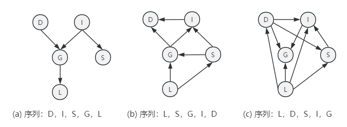

# 概率图模型

## 表示

### 贝叶斯网络

#### 朴素贝叶斯

朴素贝叶斯模型（naive Bayes model）是一个分类模型，由分类变量`C`和一定数量的、可观测的特征$X_1,X_2,...,X_k$组成。

朴素贝叶斯模型基于朴素贝叶斯假设，即可观测特征在分类变量`C`的条件下，两两独立。强独立性要求是朴素贝叶斯模型的显著特征。形式化表示为：
$$
(X_i \bot X_{-i} | C)
$$
其中$X_{-i}={X_i,...,X_k}-{X_i}$。基于独立性假设，模型的因子分解（`factorization`）表示为：
$$
P(C,X_1,...,X_k)=P(C) \Pi_{i=1}^n P(X_i|C)
$$
朴素贝叶斯模型的示意图如图所示：

#### 贝叶斯网络

贝叶斯网络同样基于条件独立，但有别于朴素贝叶斯的强独立性假设，贝叶斯网络基于局部独立性，其核心是**有向无圈图（`DGA`）**${\mathcal {G}}$，节点为随机变量。

如图所示的贝叶斯网络例子，记为${\mathcal {B}}^{student}$，随机变量包括：学生智商，课程难度，课程成绩，SAT分数和教授的推荐信的质量。变量智商的取值有两个$i^0,i^1$，课程难度的取值有两个$d^0,d^1$，课程成绩取决于课程难度和智商，包含三个取值$g^0,g^1,g^2$，SAT分数只取决于智商，两个取值$s^0,s^1$，推荐信取值$l^0,l^1$。

课程难度和智商取值为：

| $d^0$ | $d^1$ | $i^0$ | $i^1$ |
| ----- | ----- | ----- | ----- |
| 0.6   | 0.4   | 0.7   | 0.3   |

成绩的取值为：

|           | $g^0$ | $g^1$ | $g^2$ |
| --------- | ----- | ----- | ----- |
| $i^0,d^0$ | 0.3   | 0.4   | 0.3   |
| $i^0,d^1$ | 0.05  | 0.25  | 0.7   |
| $i^1,d^0$ | 0.9   | 0.08  | 0.02  |
| $i^1,d^1$ | 0.5   | 0.3   | 0.2   |

SAT和推荐信的取值为：

| SAT   | $s^0$ | $s^1$ | Letter | $l^0$ | $l^1$ |
| ----- | ----- | ----- | ------ | ----- | ----- |
| $i^0$ | 0.95  | 0.05  | $g^0$  | 0.1   | 0.9   |
| $i^1$ | 0.2   | 0.8   | $g^1$  | 0.4   | 0.6   |
|       |       |       | $g^2$  | 0.99  | 0.01  |

贝叶斯网络中，每个变量的取值是由其父节点决定，因此，可以看做每个变量是其父节点的一个随机函数，父节点取值是自变量，变量节点的取值概率是因变量。

贝叶斯网络是一个局部概率模型（`local probability model`)，变量节点依赖于父节点，对父节点的每个不同取值生成变量节点的不同分布。例如$P(G|I,D)$，Grade取决于Intelligence和Difficulty，每一对$i,d$的不同取值得到Grade的不同分布，如表成绩取值的每一行。

贝叶斯网络中每一个变量关联的是条件概率分布（`conditional probability distribution,CPD`），即已知父节点下的条件概率分布。没有父节点的变量，条件概率以空变量集为条件，得到边缘分布，如$P(D)$。

定义1：局部独立性

>贝叶斯网结构$\mathcal{G}$是其节点代表随机变量$X_1,...,X_n$的一个有向无圈图（DAG）。令${\rm{Pa}}_{X_i}^{\mathcal{G}}$表示$X_i$在$\mathcal{G}$中的父节点，${\rm{NonDescendants}}_{X_i}$表示$X_i$在图中的非后代节点变量。因此，${\mathcal{G}}$局部独立性记为：
>$$
>{\mathcal{I}}_i=:(X_i \bot {\rm{NonDescendants}}_{X_i} | {\rm{Pa}}_{X_i}^{\mathcal{G}})
>$$

定义2：分布P的独立性断言集合

> 令P是$\mathcal{X}$上的分布。${\mathcal{I}}(P)$定义为在P中成立的形如$(X \bot Y | Z)$的独立断言的集合。

定义3：I-map

> 令$\mathcal{K}$是与独立性集合${\mathcal{I(K)}}$相关联的任意一个图对象，如果对独立性集合$\mathcal{I}$，${\mathcal{I(K)}} \subseteq \mathcal{I}$，则称$\mathcal{K}$是一个I-map。

==定义1-定义3 理解小结：==

==贝叶斯网络满足局部独立性，每个局部独立性的断言，即例如（$X \bot Y | Z$）就是一个独立性断言，整个集合就是${\mathcal{I}}(P)$，满足所有局部独立要求的图就是一个I-map。==

定义4：因子分解/贝叶斯网的链式法则

> 令$\mathcal{G}$为定义在变量$X_1,...,X_n$上的一个贝叶斯网，假如P可以表示为：
> $$
> P(X_1,...,X_n)=\Pi_{i=1}^n P(X_i|{\rm{pa}}_{X_i}^{\mathcal{G}})
> $$
> 则称分布P是关于图$\mathcal{G}$的在同一空间上的因子分解。该等式也称为贝叶斯网的链式法则。单个因子$P(X_i|{\rm{pa}}_{X_i}^{\mathcal{G}})$称为条件概率分布或局部概率模型。

定义5：贝叶斯网

> 一个贝叶斯网事一个偶对$\mathcal{B}=(\mathcal{G},P)$，其中P是$\mathcal{G}$上的因子分解，也是$\mathcal{G}$的节点上的一系列条件概率分布。分布P通常标记为$P_{\mathcal{B}}$

#### 图的独立性

##### d-分离

考虑如下四种结构的有效性：

(a)：有效流通当且仅当没有观察到Z

(b)：有效流通当且仅当没有观察到Z

(c)：有效流通当且仅当没有观察到Z

(d)：有效流通当且仅当观察到Z或者Z的一个后代，$X \rightarrow Z \leftarrow Y$称之为v-结构。

定义6：有效迹

> 令$\mathcal{G}$是一个贝叶斯网结构，且$X_1 \rightleftharpoons ... \rightleftharpoons X_n$是${\mathcal{G}}$中的一条迹。令Z是观测变量的一个子集。在给定Z的条件下，若：
>
> 1. 存在一个v-结构$X_{i-1} \rightarrow X_i \leftarrow X_{i+1}$，则$X_i$或其一个后代在Z中；
>
> 2. 迹上的其他节点都不在Z中。
>
> 那么迹$X_1 \rightleftharpoons ... \rightleftharpoons X_n$是有效迹。

==从(a)-(d)四种结构观察，只有v-结构要求能被观察到又能有效，其他结构在不被观察时才有效，因此对于一个有效迹的要求是，v-结构满足有效的节点或者其后代节点必须要在条件Z中，而其他的节点则不能在条件Z中。==

定义7：d-分离/全局马尔可夫独立性

> 令$\boldsymbol {X,Y,Z}$是图${\mathcal{G}}$的三个节点集合。在给定$\boldsymbol Z$的条件下，若${\boldsymbol  X, Y}$中的任意一个节点X,Y，$X \in {\boldsymbol {X}}, Y\in {\boldsymbol {Y}}$，之间不存在有效迹，那么称${\bf X, Y}$在给定$\bf Z$的条件下是d-分离的，记作${\sf{d \text{-} sep_{\mathcal{G}}}}({\boldsymbol{X;Y|Z}})$。
>
> 与d-分离相对应的独立性的集合用$\mathcal{I(G)}=\{(X \bot Y | Z) : {\sf{d \text{-} sep_{\mathcal{G}}}}({\boldsymbol{X;Y|Z}})\}$。该集合称之为全局马尔可夫独立性（`global Markov independencies`）

##### I-等价

I-等价蕴含的意义是：完全不同的贝叶斯网的结构实际上可以是等价的，因为它们蕴含了完全相同的条件独立性断言。

定义8：I-等价

> 如果$\mathcal{I(K_1)}=\mathcal{I(K_2)}$，那么$\mathcal{X}$上的两个图结构$\mathcal{K_1}$和$\mathcal{K_2}$是I-等价的。

由d-分离可知，v-结构与众不同，与其他结构的独立断言不同，因此对于I-等价，需要额外区分v-结构。

定义9：骨架

> $\mathcal{X}$上的贝叶斯网图的骨架（`skeleton`）是$\mathcal{X}$上的一个无向图，对于$\mathcal{G}$中的每条边（X,Y），它包含边{X,Y}。

什么情况下，两个图是I-等价的？？

定理：I-等价的充分不必要条件

> 令$\mathcal{G_1}$和$\mathcal{G_2}$是$\mathcal{X}$上的两个图，如果$\mathcal{G_1}$和$\mathcal{G_2}$有相同的骨架和相同的v-结构，那么它们是I-等价的。

该定理之所以不是必要条件，考虑一个反例，对于一系列变量的完全图，因为是完全图，所以骨架一定是相同的，骨架并不考虑边的方向，而且完全图的条件独立性断言的集合是一个空集，因此任意两个完全图都是I-等价的。但是任意两个完全图却可以拥有不同的v-结构。

定义10：非正则结构

> 如果X和Y之间不存在==有向边==，那么v-结构$X \rightarrow Z \leftarrow Y$是非正则结构（immorality）。这样的边（非有向边）称之为v-结构的覆盖边（covering edge）。

定理：I-等价的充分必要条件

> 令$\mathcal{G_1}$和$\mathcal{G_2}$是$\mathcal{X}$上的两个图，如果$\mathcal{G_1}$和$\mathcal{G_2}$有相同的骨架和相同的非正则结构的==集合==，当且仅当它们是I-等价的。

#### 从分布到图

研究从分布到图的意义：研究贝叶斯网图的表示学习，贝叶斯网是如何构建的？贝叶斯网是对现实情况的描述，而现实情况可以看做原本是系列性条件独立关系集合，即$\mathcal{I}(P)$，以及变量集合$\mathcal{X}$。由$\mathcal{I}(P)$和$\mathcal{X}$构造相应的贝叶斯网，这个过程没有想象中的那么容易，可以从例子中发现，当从不同的变量作为起始变量开始逐一满足$\mathcal{I}(P)$，得到的贝叶斯网结构是完全不同的，复杂度也不一样。因此需要思考，如何由$\mathcal{I}(P)$和$\mathcal{X}$得到一个最合适的贝叶斯网呢？这个最合适的贝叶斯网就是==最小的I-map==。

最小的I-map意味着：丢掉任何一个边，得到的图都不再是I-map，即不满足$\mathcal{I}(P)$的独立性条件了。

##### 最小I-map

定义11：最小I-map

> 假如图$\mathcal{K}$是独立关系集$\mathcal{I}$的一个I-map，从$\mathcal{K}$移除某一条边都会使其不再是I-map，那么图$\mathcal{K}$是$\mathcal{I}$的最小I-map。

给定一个变量集合的序列，以及场景下的独立关系集合，构造最小I-map的过程中可以发现一个问题，不同的拓扑序列得到不同的I-map。以上述的${\mathcal {B}}^{student}$为例，变量集合$\mathcal{X}=\{D,G,I,S,L\}$，独立条件约束集合为：

+ (I$\bot$D)
+ (S$\bot$D,G,L|I)
+ (S$\bot$G|I,D)
+ (L$\bot$D,I,S|G)

如图所示，不同的拓扑序列下生成的最小I-map结果不同。

以(b)情况为例，构造的过程如下：

（1）：L作为孤立点进入；

（2）：加入S，此时集合{L}的任意非空子集可能是S的父节点，由独立条件约束集合判断S与L是否独立。可知，(S⊥L|I)，但此时没有I，因此不满足独立条件，L作为S的父节点；

（3）：加入G，此时集合{L,S}的任意一个非空子集都可能是G的父节点，考虑G与任意一个节点是否独立。(S⊥G|I)成立，但此时没有I，独立条件不成立，且L与G不独立，因此L和S都是G的父节点；

（4）：加入I，此时集合{L,S,G}的任意一个非空子集都可能是I的父节点，S与I不独立，因此S是I的父节点，G与I不离地，因此G是I的父节点，(L⊥I|G)满足，因此L不是I的父节点；

（5）：加入D，此时集合{L,S,G,I}任意非空子集都可能是D的父节点，(L⊥D|G)，L不是D的父节点，(S⊥D|I)满足，S不是D的父节点，I连接D，G与D不独立，G是D的父节点。（==存在问题：违反了D⊥I的独立条件==）

由上述例子可知，从分布构建图的过程，使用最小I-map的算法，生成的贝叶斯网络图不仅因为拓扑序列不同结果不同，不满足唯一性，而且还可能与原本的独立性约束发生冲突。因此，由最小I-map来构造满足分布P的图$\mathcal{G}$是不满足的。进一步提出p-map的概念。

##### P-map

P-map(Perfect-map，完美映射)

定义12：P-map

> 对于独立性集合$\mathcal{I}$，如果$\mathcal{I(K)=I}$，则称图$\mathcal{K}$是$\mathcal{I}$的一个P-map，如果$\mathcal{I(K)=I(P)}$，则称$\mathcal{K}$是P的一个P-map。

由定义可知，满足分布P的P-map要求比I-map更加严格，图$\mathcal{K}$的独立性集合与分布P的独立性集合是相同的。但是，这样的P-map并不是总是存在，有的分布并不存在P-map。其中一种情况就是构造的图并不能完全满足场景下的独立约束条件。

假设某个分布的P-map是存在的，应该如何找到这个分布的P-map呢？

事实上，满足分布P的P-map并非唯一确定的，典型的例子就是(X⊥Y|Z)条件独立分布，可以有三种不同的图结构（除v-结构以外）。因此，不能由分布确定唯一的P-map，但是由同一分布得到的不同图结构，它们一定是I-等价的（满足相同的独立分布集合就是I-等价的）。

因此，从I-等价的角度来考虑找到P-map，但此时的P-map不是一个，而是一个集合，称之为I-等价类。

首先思考I-等价的充分必要条件：

> 令$\mathcal{G_1}$和$\mathcal{G_2}$是$\mathcal{X}$上的两个图，如果$\mathcal{G_1}$和$\mathcal{G_2}$有相同的骨架和相同的非正则结构的==集合==，当且仅当它们是I-等价的。

由I-等价的充要条件可知，两个关键点就是构造骨架和识别非正则结构。

==步骤一：构造无向的骨架==

构造骨架的过程是避免方向的干扰，从变量集合$\mathcal{X}$的无向完全图开始，每次选择两个变量$X_i,X_j$，在给定的独立条件集合中判断，是否存在一个集合U，使得$(X_i \bot X_j|U)$满足，如果存在这样一个U，则移除$X_i,X_j$之间的无向边，集合U此时称之为$X_i,X_j$独立性的见证`witness`。（该U集合一般是$X_i$或者$X_j$的父集合，但是因为是无向图，没有明确指向，因此U集合一般是$U \subseteq \text{Nb}_{X_i}^{\mathcal{H}}-{X_j}$表示无向图$\mathcal{H}$中$X_i$邻居节点集合去掉$X_j$）

以${\mathcal {B}}^{student}$​为例构造无向骨架。变量集合$\mathcal{X}=\{D,G,I,S,L\}$，独立条件约束集合为：

+ (I$\bot$D)
+ (S$\bot$D,G,L|I)
+ (S$\bot$G|I,D)
+ (L$\bot$D,I,S|G)

（0）：无向完全图

（1）：选择{S,L}两点，由独立条件约束集合可知，(S⊥L|I)，因此移除S和L之间的边；

（2）：选择{L,D}两点，(L⊥D|G)成立，移除L与D之间的边；

（3）：选择{D,I}两点，(I$\bot$D)，移除I、D之间的边；

（4）：选择{G,I}两点，找不到见证U使得G⊥I，因此保留G、I之间的边；

（5）：选择{S,G}两点，(S$\bot$G|I,D)，移除S与G之间的边；

（6）：选择{S,I}，找不到见证U使得S⊥I，保留边；

（7）：选择{G,L}，同样找不到见证U，保留边；

（8）：选择{G,D}，找不到见证U，保留边；

（9）：选择{L,I}，(L⊥I|G)，移除L、I之间的边；

（10）：选择{S,D}，(S⊥D|I)，移除S、D之间的边；

整理一下得到（11）所示。此时得到的骨架与原本的图结构的骨架是完全相同的。

==步骤二：识别非正规结构==

对于第一步得到的骨架，需要考虑每个可能的非正规结构是否满足（是否满足仍然取决于独立条件约束集合）。

回顾非正规结构的定义：

> 如果X和Y之间不存在==有向边==，那么v-结构$X \rightarrow Z \leftarrow Y$是非正则结构（immorality）。这样的边（非有向边）称之为v-结构的覆盖边（covering edge）。

（11）中可能的非正规结构有：$L\rightarrow G \leftarrow D$、$L\rightarrow G \leftarrow I$、$D\rightarrow G \leftarrow I$、$G\rightarrow I \leftarrow S$

非正规结构源于v-结构，v-结构独立性满足的条件是，如$L\rightarrow G \leftarrow D$，G不能被观察到，因此得出$G \notin U$（见证U是L、D独立的条件，想要L、D独立，G就不属于U）。分别判断非正则结构如下：

+ $L\rightarrow G \leftarrow D$，(L⊥D|G)，$G \in U$，因此$L\rightarrow G \leftarrow D$的非正则结构不成立。
+ $L\rightarrow G \leftarrow I$，(L⊥I|G)，$L\rightarrow G \leftarrow I$的非正则结构不成立。
+ $D\rightarrow G \leftarrow I$，(I$\bot$D)，此时U=∅，G∉U，因此$D\rightarrow G \leftarrow I$非正则结构成立，可以确定两个方向。
+ $G\rightarrow I \leftarrow S$，(S$\bot$G|I,D)，此时$U=\{I,D\},I \in U$，不满足，非正则结果不成立。

判别非正则结构后得到的图如(1)所示。还能够进一步得到（2），因为G和L之间只能满足$G \rightarrow L$，如果$L \rightarrow G$，则出现了无效的非正则结构。

为了对这一集合的I-等价类有一个统一的名称，使用类PDAG描述。因此，可以认为构造骨架+识别非正规结构得到的就是一个类PDAG。

> PDAG:部分的有向无圈图，即无圈图，图中既存在有向边，又存在无向边。

确定类PDAG中节点边的方向存在三种规则：

R1:非法的非正规结构

R2：满足无圈图要求

R3：使用反证法说明，若Z→X，为了满足R2的无圈图要求，则必然是Y1→X，同理Y2→X，会得到Y1→X←Y2，并且Y1和Y2还是无边的，Y1→X←Y2构造出了一个非正则结构，与原来的PDAG不相符，因此只能由X→Z成立。

